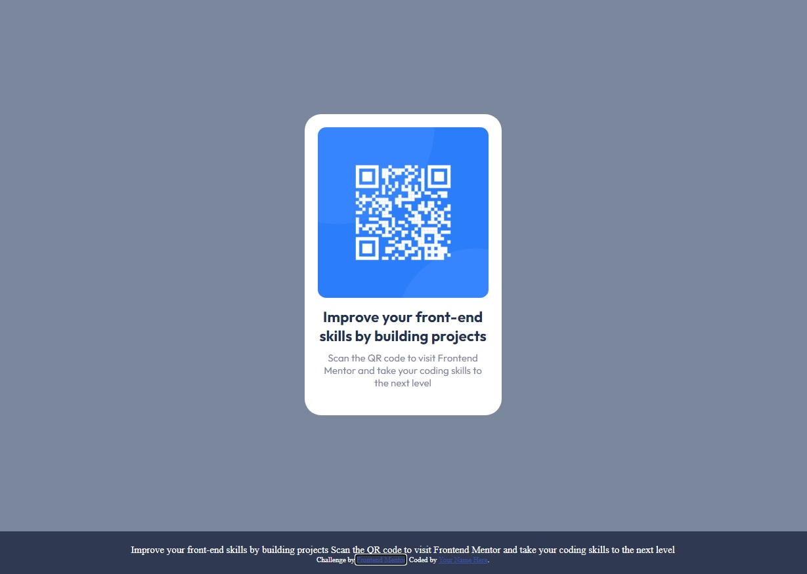

# Frontend Mentor - QR code component solution

This is a solution to the [QR code component challenge on Frontend Mentor](https://www.frontendmentor.io/challenges/qr-code-component-iux_sIO_H). Frontend Mentor challenges help you improve your coding skills by building realistic projects. 

## Table of contents

- [Screenshot](#screenshot)
- [Links](#links)
- [Built with](#built-with)
- [Author](#author)

### Screenshot

### Links

- Solution: [https://github.com/LuisOrtega27/QR-code-component]
- Live Site URL: [https://luisortega27.github.io/QR-code-component]

### Built with

- Semantic HTML5 markup
- CSS Grid
- Mobile-first workflow

## Author

- Frontend Mentor - [@LuisOrtega27](https://www.frontendmentor.io/profile/LuisOrtega27)